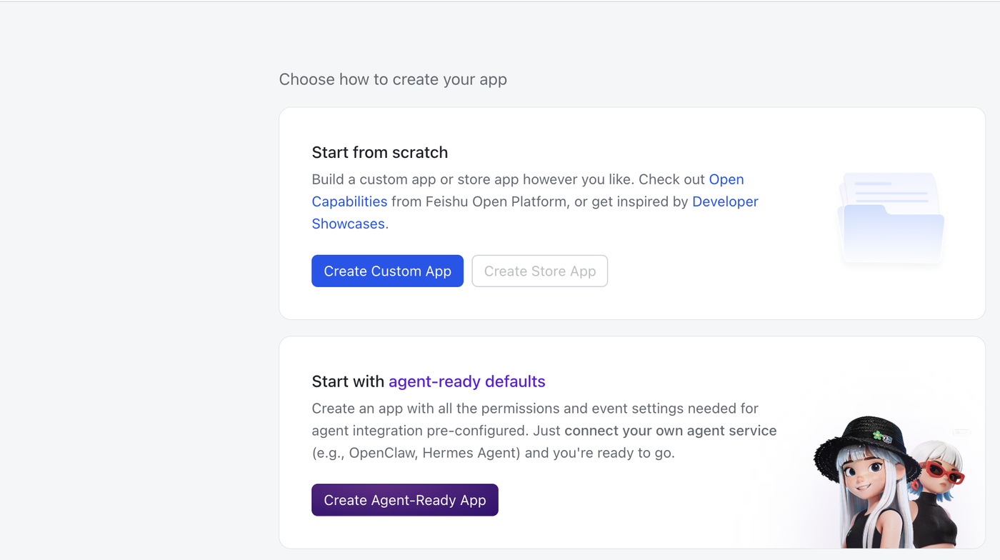
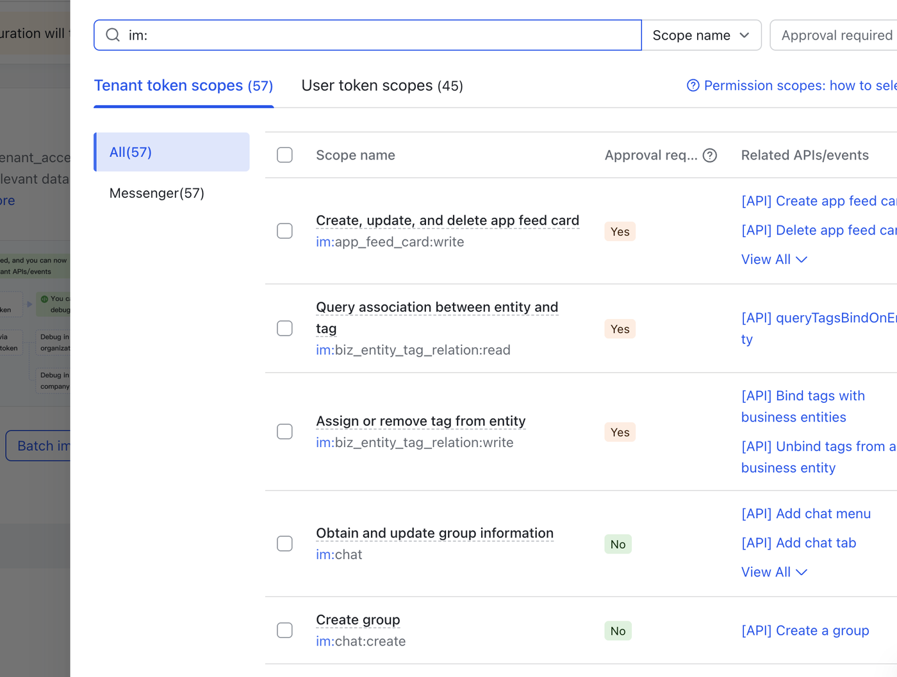
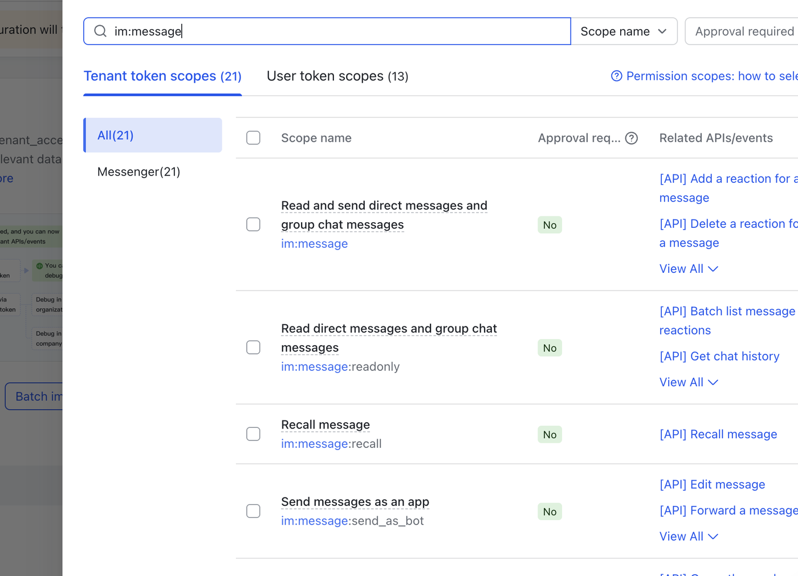
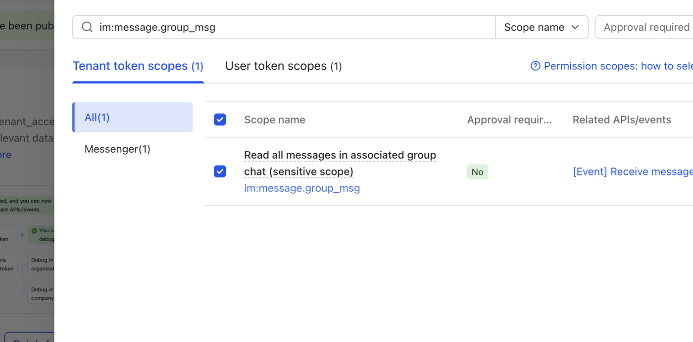
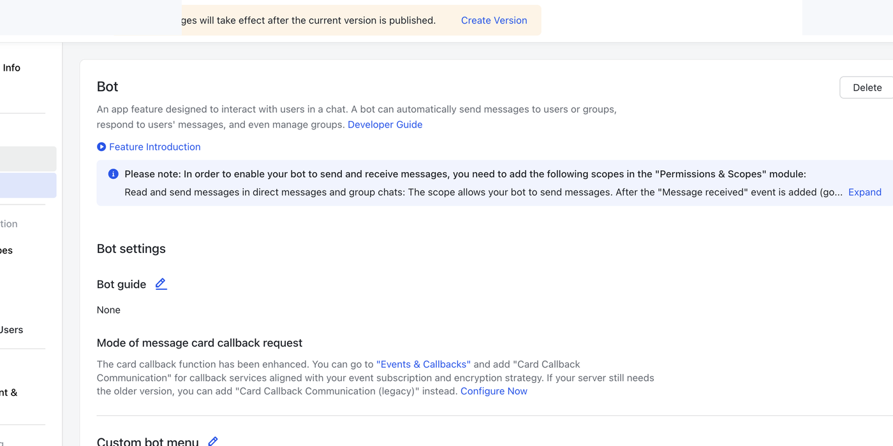
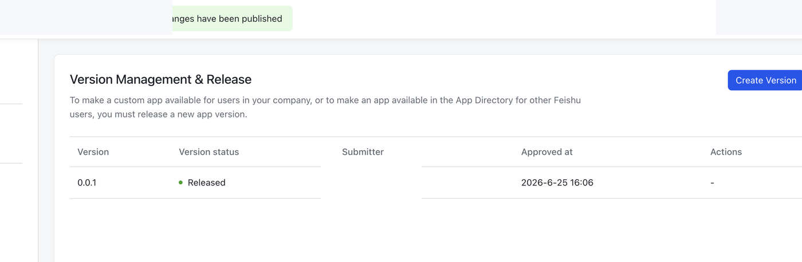

# Feishu Obsidian Inbox

Sync quick notes from a Feishu / Lark group chat into an Obsidian inbox note.

Use Feishu / Lark on your phone as a lightweight capture inbox, then click one button in Obsidian to pull new messages into a local Markdown file.

```text
Phone → Feishu / Lark group → Obsidian inbox note
```

## Features

- Manual sync from the Obsidian ribbon.
- Command palette command: `Sync Feishu Inbox`.
- Built-in setup guide in plugin settings.
- Writes to a vault-relative Markdown file, such as `Inbox/Feishu Inbox.md`.
- Keeps bounded local sync state to avoid duplicate imports.
- Filters system messages such as group creation and bot invitation events.
- Uses each user's own Feishu / Lark custom app. No shared credentials are included.

## Before You Start

You need:

- An Obsidian vault.
- A Feishu / Lark account.
- Permission to create a Feishu / Lark custom app.
- A Feishu / Lark group chat used as your mobile inbox.

Each user creates their own Feishu / Lark app and bot. Do not use another person's App ID or App Secret.

## Install

1. Open Obsidian Settings.
2. Go to `Community plugins`.
3. Search for `Feishu Obsidian Inbox`.
4. Install and enable the plugin.

## Feishu / Lark Setup

The Feishu / Lark setup is the only slightly fussy part. The plugin includes a shorter built-in guide in its settings page.

### 1. Create a Custom App

1. Open Feishu Open Platform.
2. Open Developer Console.
3. Create a Custom App.
4. Do not create a store app.
5. Use any private name, such as `Feishu Obsidian Inbox`.



### 2. Copy App Credentials

In the app console, open `Credentials & Basic Info`.

Copy:

```text
App ID
App Secret
```

Paste them into the Obsidian plugin settings:

```text
Feishu App ID
Feishu App Secret
```

The App Secret is stored locally in your vault's plugin data. Do not publish your vault's `.obsidian` configuration if it contains secrets.

### 3. Add Permissions

Open `Permissions & Scopes`, then add these tenant token scopes:

```text
im:chat
im:message:readonly
im:message.group_msg
```

In the Feishu UI, these may appear as:

```text
Obtain and update group information
Read direct messages and group chat messages
Read all messages in associated group chat
```

If Feishu reports this error:

```text
need scope: im:message.group_msg
```

add `im:message.group_msg`, then publish the app again.







### 4. Enable Bot

Open `Add Features`, then add the `Bot` feature.

After changing permissions or adding the Bot feature, publish a new app version. Feishu changes do not take effect until the app is published.





### 5. Add the Bot to Your Inbox Group

Open the Feishu / Lark group chat you want to use as your mobile inbox.

In group settings, add the bot/app you created.

### 6. Fill Plugin Settings

In Obsidian, open the plugin settings and fill:

```text
Feishu App ID
Feishu App Secret
Chat ID
Target file
```

The `Chat ID` usually starts with `oc_`.

The `Target file` is vault-relative, for example:

```text
Inbox/Feishu Inbox.md
```

Use `List visible chats` in the plugin settings if you need help finding the group `Chat ID`. Pick the target group from the list and the plugin will save the Chat ID.

## Usage

Send a message to your Feishu / Lark inbox group from your phone.

Then in Obsidian:

- Click the inbox ribbon icon, or
- Run `Sync Feishu Inbox` from the command palette.

Synced messages are appended like this:

```markdown
## 2026-06-25

- [ ] 16:31 #feishu
  This is a temporary note
  <!-- feishu_message_id: om_xxx -->
```

## Troubleshooting

`No chats visible to this app.`

The bot probably has not been added to the target group, or the app version containing the Bot feature has not been published.

`need scope: im:message.group_msg`

Add the `im:message.group_msg` scope in Feishu Open Platform and publish a new app version.

`Missing settings`

Open the plugin settings and fill App ID, App Secret, Chat ID, and Target file.

## Privacy

This plugin talks directly to Feishu / Lark Open Platform from your Obsidian app.

It stores:

- Your plugin settings in local Obsidian plugin data.
- Recent message IDs and the latest processed timestamp for duplicate prevention.

It does not ship shared credentials. Your App Secret belongs to your own Feishu / Lark app.

## Links

- [Latest release](https://github.com/qqyzk/feishu-obsidian-inbox/releases/latest)
- [GitHub repository](https://github.com/qqyzk/feishu-obsidian-inbox)
- [Detailed Feishu / Lark setup notes](docs/feishu-setup.md)
- [Project and development notes](docs/project.md)
