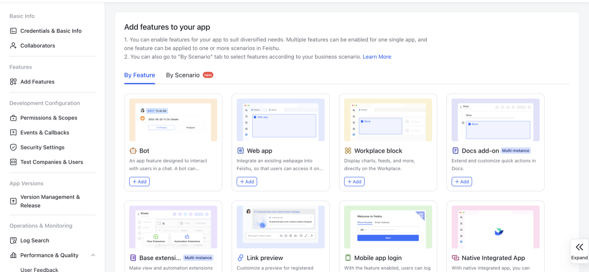
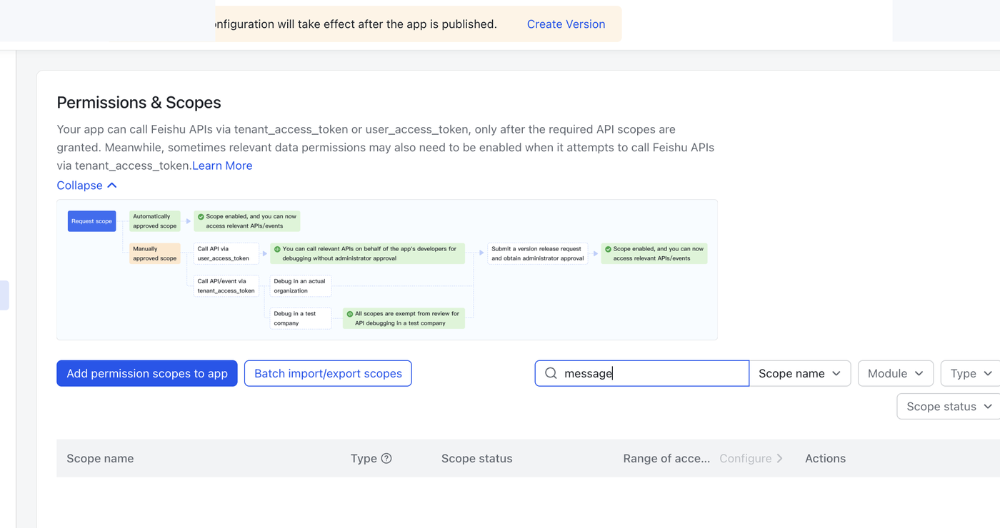

# Feishu / Lark App Setup

This guide will explain how to create a Feishu / Lark custom app for the Obsidian inbox sync plugin.

## What You Need

Each user needs their own Feishu / Lark custom app. Do not use another person's App ID or App Secret.

## Required Permissions

Add these tenant token scopes:

```text
im:chat
im:message:readonly
im:message.group_msg
```

The app also needs the Bot feature enabled and published.

## Setup Outline

1. Open Feishu Open Platform.
2. Create a custom app.
3. Copy the App ID and App Secret.
4. Add Messenger permissions.
5. Enable the Bot feature.
6. Publish a new app version.
7. Add the bot to the target Feishu group.
8. Copy the group `chat_id` into the Obsidian plugin settings.

The screenshots below are cropped and redacted to avoid exposing personal names, profile avatars, app URLs, and secrets.

## Screenshots

Before adding or replacing screenshots, redact:

- Browser profile avatars.
- Personal names and organization names.
- App IDs or app IDs visible in URLs.
- App Secret values.
- Any group names that should remain private.

The plugin also includes a built-in text setup guide in its settings page, so users can complete setup without leaving Obsidian. This document is the longer screenshot-friendly version.

### Create a custom app

Choose `Create Custom App`.


### Add app features

The app console contains feature cards such as Bot, Web app, and Docs add-on.



### Open permissions

Open `Permissions & Scopes`, then add the required Messenger permissions.



### Add `im:chat`

Choose `Obtain and update group information`.


### Add `im:message:readonly`

Choose `Read direct messages and group chat messages`.


### Add `im:message.group_msg`

Choose `Read all messages in associated group chat`.


### Enable Bot

Add the Bot feature, then publish a new app version.


### Publish the app version

Feishu changes do not take effect until the current version is published.


## Notes From a Working Setup

The following flow has been tested:

1. Create a custom app in Feishu Open Platform.
2. Copy App ID and App Secret.
3. Add these scopes:

```text
Obtain and update group information
im:chat

Read direct messages and group chat messages
im:message:readonly

Read all messages in associated group chat
im:message.group_msg
```

4. Enable the Bot feature.
5. Publish a new app version after changing scopes or features.
6. Add the bot to the target group in Feishu.
7. Use the plugin settings to fill App ID, App Secret, and Chat ID.

If Feishu returns `need scope: im:message.group_msg`, add `im:message.group_msg` and publish the app again.

## Plugin Settings

After the app is published and the bot is added to the target group, fill these fields in Obsidian:

```text
Feishu App ID
Feishu App Secret
Chat ID
Target file
```

`Target file` is vault-relative, for example:

```text
Inbox/Feishu Inbox.md
```

The plugin writes only to this target file and stores sync state in local plugin data.
